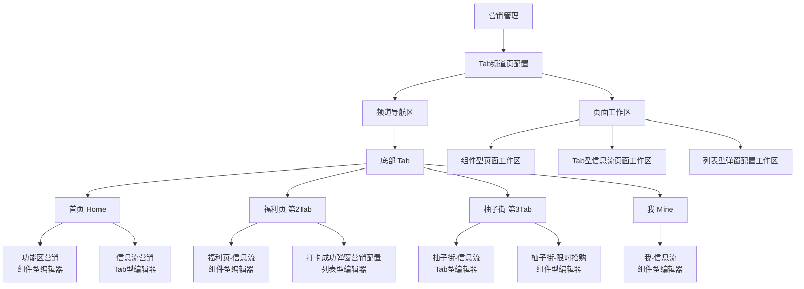
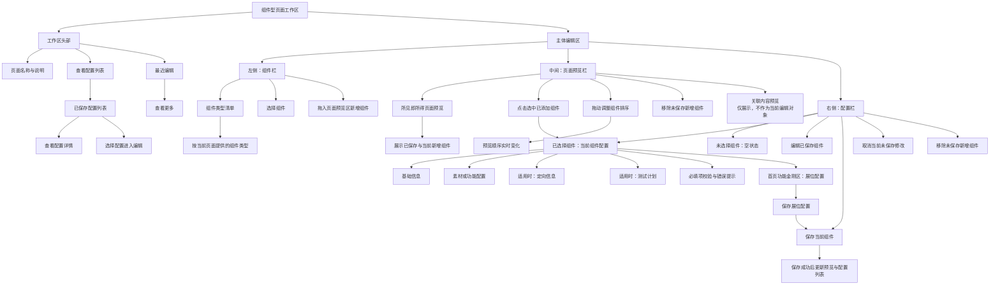
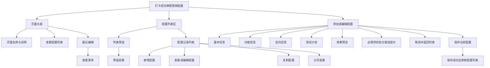
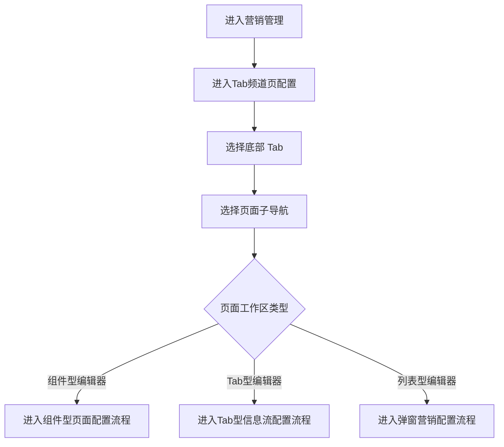
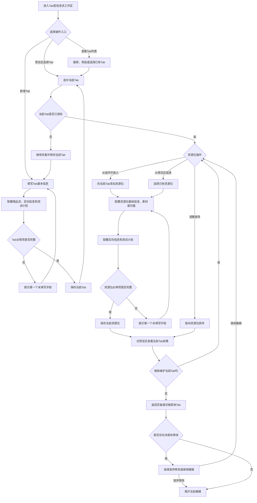
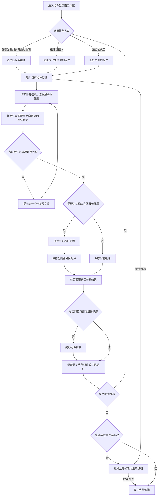
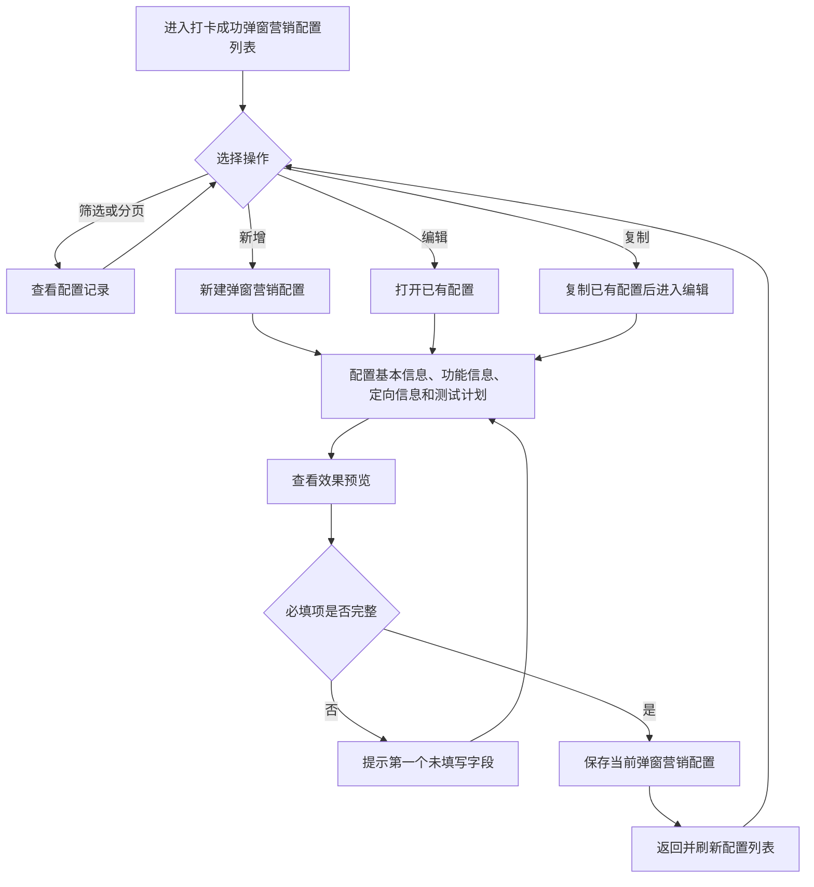

# Tab频道页配置

> 本文描述运营后台“营销管理 > Tab频道页配置”的产品信息架构与关键操作流程。结构图按页面工作区拆分，流程图仅描述运营操作、配置校验与状态判断，不包含研发实现逻辑。

## 1. 产品结构图

### 1.1 全局频道与页面结构

| 页面子导航 | 页面类型 | 主要维护对象 |
| --- | --- | --- |
| 首页 - 功能区营销 | 组件型编辑器 | 功能金刚区、功能区橱窗、红包发放功能 |
| 首页 - 信息流营销 | Tab型编辑器 | 信息流 Tab、Tab 内资源位 |
| 福利页 - 信息流 | 组件型编辑器 | 拼图、宫格、红包发放功能 |
| 福利页 - 打卡成功弹窗营销配置 | 列表型编辑器 | 弹窗营销配置 |
| 柚子街 - 信息流 | Tab型编辑器 | 信息流 Tab、Tab 内资源位 |
| 柚子街 - 限时抢购 | 组件型编辑器 | 当前可配置组件 |
| 我 - 信息流 | 组件型编辑器 | 当前可配置组件 |

### 1.2 组件型页面工作区结构

适用页面：首页 - 功能区营销、福利页 - 信息流、柚子街 - 限时抢购、我 - 信息流。

**组件型页面结构规则**

1. 页面工作区固定由组件栏、页面预览栏、配置栏构成；组件栏负责添加，预览栏负责所见即所得与排序，配置栏负责当前选中对象的编辑和保存。
2. `查看配置列表`用于查看已保存配置；`最近编辑`用于快速回到最近维护的对象，超过当前展示范围时通过`查看更多`进入完整列表。
3. 保存是对象级操作：保存当前组件，或在功能金刚区场景先保存展位配置、再保存功能金刚区组件；不在此页面定义统一的“整页保存”动作。
4. 删除或移除仅针对当前未保存的新增组件；已保存对象需进入编辑路径维护。

### 1.3 Tab型信息流页面工作区结构

适用页面：首页 - 信息流营销、柚子街 - 信息流。

```mermaid
flowchart TB
  A[Tab型信息流页面工作区] --> B[工作区头部]
  A --> C[主体编辑区]

  B --> B1[页面名称与说明]
  B --> B2[查看Tab列表]
  B --> B3[最近编辑]
  B3 --> B31[查看更多]

  B2 --> TL[Tab列表弹层]
  TL --> TL1[搜索与筛选]
  TL --> TL2[新增 Tab]
  TL --> TL3[查看或编辑 Tab]
  TL --> TL4[展位管理]
  TL4 --> PL[展位管理弹层]
  PL --> PL1[展位列表]
  PL --> PL2[添加、编辑、复制展位]

  C --> L[左侧：组件栏]
  C --> P[中间：页面预览栏]
  C --> R[右侧：配置栏]

  L --> L1[信息流-拼图]
  L --> L2[信息流-红包发放功能]
  L --> L3[信息流-原生滑块]
  L --> L4[选择资源位组件]
  L --> L5[当前Tab保存后可拖入资源位]

  P --> P1[Tab预览导航]
  P1 --> P11[选择当前 Tab]
  P1 --> P12[新增 Tab]
  P --> P2[当前Tab资源位预览]
  P2 --> P21[拖入资源位新增资源位]
  P2 --> P22[点击选择资源位进入配置]
  P2 --> P23[拖动调整资源位排序]
  P23 --> P231[预览顺序实时变化]
  P2 --> P24[移除未保存新增资源位]
  P --> P3[Tab状态与资源位状态筛选]

  R --> R1[未选择Tab：空状态]
  R --> R2[选择Tab：Tab配置]
  R2 --> R21[基本信息]
  R2 --> R22[商品流配置]
  R2 --> R23[定向信息]
  R2 --> R24[测试计划]
  R2 --> R25[编辑已保存Tab]
  R2 --> R26[Tab必填校验]
  R2 --> R27[保存当前Tab]
  R27 --> R271[保存后允许拖入资源位]
  R --> R3[选择资源位：资源位配置]
  R3 --> R31[基础信息]
  R3 --> R32[素材或功能配置]
  R3 --> R33[定向信息]
  R3 --> R34[测试计划]
  R3 --> R35[编辑已保存资源位]
  R3 --> R36[资源位必填校验]
  R3 --> R37[保存当前资源位]
  R37 --> R371[保存成功后更新预览与Tab列表]
  R3 --> R38[取消未保存修改]
  R3 --> R39[移除未保存新增资源位]
```

**Tab型页面结构规则**

1. `查看Tab列表`是集中维护入口，包含筛选、搜索、新增、编辑与展位管理；展位管理内继续维护展位列表及添加、编辑、复制等操作。
2. 预览栏以当前 Tab 为上下文。运营人员先选择或新建 Tab，再查看其资源位、添加资源位及调整资源位顺序。
3. 新增 Tab 必须完成必填配置并保存，左侧组件栏才允许向该 Tab 拖入资源位。
4. 右侧配置栏随选择对象切换：选中 Tab 时维护 Tab；选中资源位时维护资源位。两者均按当前对象保存，不定义统一的“保存整页”按钮。

### 1.4 打卡成功弹窗营销配置页面结构

**列表型页面结构规则**

1. 本页面以配置列表为主操作界面，新增、编辑、复制均进入单条配置的编辑态。
2. 效果预览用于辅助确认当前配置；保存仅保存当前弹窗营销配置，成功后回到并刷新配置列表。

## 2. 产品流程图

### 2.1 进入频道页与页面类型分流

**流程说明**：频道选择决定当前可维护页面；页面子导航决定工作区类型与后续操作路径。运营人员可通过`查看配置列表`、`查看Tab列表`、`最近编辑`或`查看更多`快速定位已保存对象，但其后仍进入对应对象的编辑流程。

### 2.2 Tab型信息流配置流程

**关键规则**

1. 新增 Tab 先完成并保存 Tab 配置，再向该 Tab 添加资源位。
2. Tab 与资源位分别独立校验、独立保存；保存成功后，当前对象的内容成为可在列表和预览中继续维护的配置。
3. 排序在当前 Tab 的预览区完成；排序后继续按照当前页面提供的保存动作提交对应对象。
4. 离开当前编辑且存在未保存修改时，运营人员需选择放弃修改或继续编辑。

### 2.3 组件型页面配置流程

**关键规则**

1. 可从组件栏新增、从配置列表或最近编辑进入已保存对象，也可直接从预览区选择页面内组件。
2. 保存是当前组件级操作。功能金刚区存在展位配置时，应先保存展位配置，再保存功能金刚区组件。
3. 未保存的新增组件可从预览区移除；已保存组件通过选择组件后进入编辑流程维护。
4. 组件排序以预览区内的实际顺序为准，操作后继续执行当前对象对应的保存动作。

### 2.4 打卡成功弹窗营销配置流程

**关键规则**

1. 新增、编辑、复制均以单条弹窗营销配置为操作对象。
2. 效果预览用于运营确认；保存前完成当前配置的必填校验，保存成功后列表展示最新结果。
3. 本流程不定义与其他频道页共用的整体发布或页面级保存步骤。
