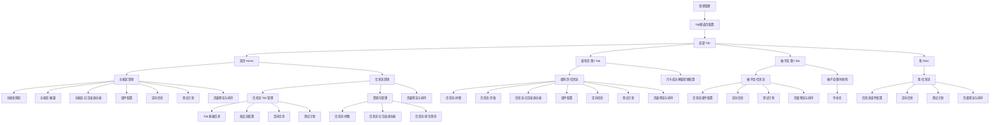
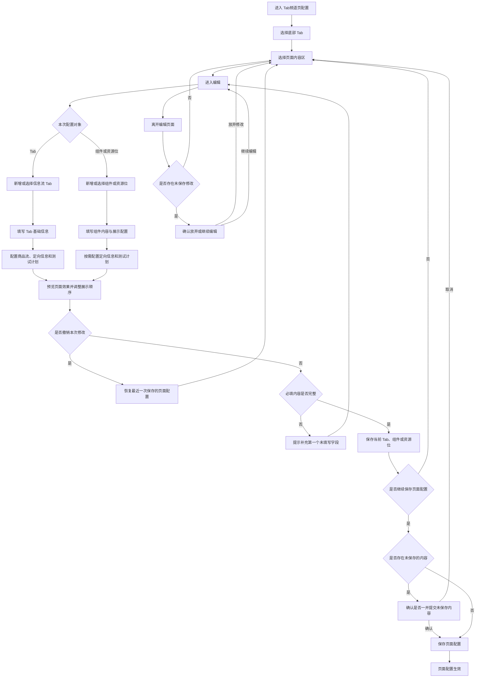

# Tab频道页配置

## 1. 产品结构图

说明：

1. “Tab频道页配置”以底部 Tab 为一级组织维度，再按各 Tab 下的页面内容区管理营销内容。
2. 同一内容区内，组件或资源位的基础配置、定向信息、测试计划、预览和排序共同构成可维护内容；实际展示字段随组件类型而变化。
3. “柚子街-限时抢购”当前仅保留导航结构，配置能力待补充，本结构图不展开其业务配置内容。
4. “我-信息流”的具体组件范围以最终业务确认的组件清单为准。

## 2. 产品流程图

### 2.1 关键流程规则

1. 运营人员先选择目标底部 Tab 和对应页面内容区，再进入该区域的配置流程。
2. 信息流 Tab 的新增或修改，需要先完成并保存当前 Tab，才可继续维护该 Tab 下的资源位内容。
3. 配置对象分为两类：
   - Tab：维护 Tab 基础信息，以及适用的商品流、定向信息和测试计划。
   - 组件或资源位：维护展示内容、素材或跳转等组件配置，并按需配置定向信息和测试计划。
4. 保存分为当前对象保存和页面配置保存两个层级：
   - 当前对象保存：确认当前 Tab、组件或资源位的配置。
   - 页面配置保存：确认当前页面内容区的整体配置并使其生效。
5. 存在未保存内容时保存页面，需由运营人员确认是否一并提交；取消确认则回到当前页面继续处理。
6. 必填内容未完成时不能保存，系统提示第一个未填写字段，运营人员补充后可再次保存。
7. 编辑期间可预览页面效果并调整组件或资源位的展示顺序；预览与排序完成后再执行保存。
8. 选择“撤销本次修改”时，恢复最近一次保存的页面配置；离开编辑页且存在未保存修改时，需先确认放弃修改或继续编辑。
