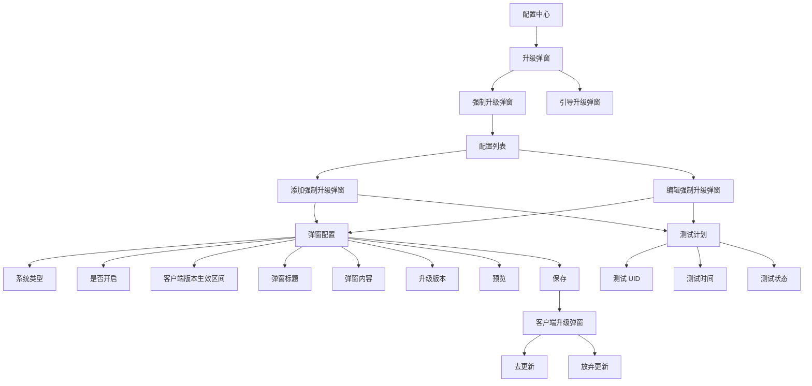
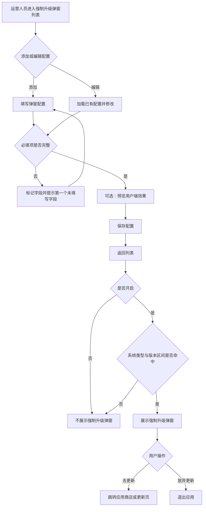

# 强制升级弹窗需求说明

## 1. 概述

### 1.1 目标

运营人员可按客户端系统与版本区间配置强制升级提示，并可通过测试计划白名单在指定时间内向指定 UID 验证配置效果。命中有效配置或测试白名单的用户，在客户端看到升级弹窗后可前往更新；强制升级场景下，用户放弃更新后退出应用。

### 1.2 导航位置

`配置中心 > 升级弹窗 > 强制升级弹窗`

### 1.3 角色

| 角色 | 主要职责 |
| --- | --- |
| 运营人员 | 新增、编辑、预览并维护升级弹窗配置与测试计划 |
| 客户端用户 | 命中配置后查看升级弹窗，并选择去更新或放弃更新 |
| 客户端/服务端 | 优先校验测试计划白名单；未命中白名单时，再依据系统、版本和开关判断配置是否生效，并执行升级跳转或退出应用策略 |

## 2. 产品结构图

## 3. 产品流程图

## 4. 功能需求

### 4.1 列表管理

1. 列表默认展示已保存的强制升级弹窗配置。
2. 列表字段定义如下：

| 字段 | 输入框类型 | 是否必填 | 定义 | hover说明 | 底纹词 | 需求额外说明 |
| --- | --- | --- | --- | --- | --- |
| 系统类型 | 文本展示 | 是 | 展示该配置适用的客户端系统类型，取自弹窗配置的“系统类型”。 | 用于识别强制升级弹窗适用的客户端系统。 | - | 值为 Android、iOS、Harmony；系统类型是常规命中规则之一。 |
| 是否开启 | 状态展示 | 是 | 展示该条强制升级弹窗配置的常规生效状态，取自弹窗配置的“是否开启”。 | 开启后才会进入系统类型和客户端版本区间校验；测试计划白名单命中时不受此状态限制。 | - | 值为“开启”或“关闭”；“开启”使用高亮状态样式。 |
| 客户端版本生效区间（含头尾） | 文本展示 | 是 | 展示常规规则下可触发弹窗的客户端版本范围，取自最低版本和最高版本。 | 仅当客户端版本处于该区间内时，才会命中常规强制升级规则。 | - | 按“最低版本 - 最高版本”格式展示；两个边界版本均包含。测试计划白名单命中时不校验此字段。 |
| 弹窗标题 | 文本展示 | 是 | 展示用户端强制升级弹窗的标题，取自弹窗配置的“弹窗标题”。 | 用于用户端展示的弹窗标题。 | - | 最多 40 个字符；列表超长时单行截断，完整内容可在编辑页查看。 |
| 升级版本 | 文本展示 | 是 | 展示本次升级对应的版本标识，取自弹窗配置的“升级版本”。 | 用于后台识别当前强制升级的版本批次。 | - | 最多 20 个字符；不替代客户端版本生效区间的命中判断。 |
| 是否有测试计划 | 枚举展示 | 否 | 展示该记录是否已配置测试计划白名单。 | 测试计划为白名单；测试状态开启、UID 和测试时间命中时，可无视常规规则直接展示弹窗。 | - | 测试 UID、测试时间或测试状态任一字段已配置时展示“有”，否则展示“-”；“有”不代表白名单当前已生效。 |
| 创建人 | 文本展示 | 否 | 展示首次保存该记录的操作人。 | 用于追溯该强制升级配置的创建来源。 | - | 新建时自动写入；编辑时不可修改；历史数据缺失时展示“-”。 |
| 创建时间 | 时间展示 | 否 | 展示首次保存该记录的时间。 | 用于追溯该强制升级配置的创建时间。 | - | 格式为 `YYYY-MM-DD HH:mm:ss`；新建时自动写入，编辑时不可修改；历史数据缺失时展示“-”。 |
| 最后更新人 | 文本展示 | 否 | 展示最近一次保存该记录的操作人。 | 用于追溯该配置最后一次变更的操作人。 | - | 每次编辑保存后自动更新；历史数据缺失时展示“-”。 |
| 更新时间 | 时间展示 | 否 | 展示最近一次保存该记录的时间。 | 用于追溯该配置最后一次变更的时间。 | - | 格式为 `YYYY-MM-DD HH:mm:ss`；每次编辑保存后自动更新；新建后初始值与创建时间一致。 |
| 操作 | 文字按钮 | 否 | 提供当前记录的可执行操作。 | - | - | 当前仅提供“编辑”；点击后进入对应配置的编辑页。列表页不提供删除、复制或列表内启停操作。 |

3. 点击“添加”进入添加页；点击“编辑”进入编辑页。两类页面均保留左侧导航，并通过左上角返回或“取消”回到列表。
4. 保存后的演示数据应持久化在浏览器本地存储；刷新页面或切换页面后应可恢复。

### 4.2 添加与编辑

#### 4.2.1 弹窗配置

| 字段 | 控件类型 | 必填 | 规则与说明 |
| --- | --- | --- | --- |
| 系统类型 | Select | 是 | 可选 Android、iOS、Harmony。默认值为 Android。 |
| 是否开启 | 单选按钮组 | 是 | 可选“开启”“关闭”。只有开启的配置才可被客户端命中。 |
| 客户端版本生效区间 | 两个文本输入框 | 是 | 分别填写最低版本（含）和最高版本（含）；两个值必须同时填写。 |
| 弹窗标题 | 文本输入框 | 是 | 用户端展示标题，最多 40 个字符。 |
| 弹窗内容 | 富文本编辑器 | 是 | 支持加粗、斜体、下划线、无序列表和链接；以非空文本作为必填判断依据。 |
| 升级版本 | 文本输入框 | 是 | 本次升级对应的版本标识，最多 20 个字符。 |

#### 4.2.2 测试计划

测试计划为非必填模块，用于配置强制升级弹窗的测试白名单。

| 字段 | 控件类型 | 必填 | 规则与说明 |
| --- | --- | --- | --- |
| 测试 UID | 文本输入框 | 否 | 多个 UID 使用英文逗号分隔。 |
| 测试时间 | 起止日期时间 | 否 | 配置开始时间和结束时间，用于限定测试有效期。 |
| 测试状态 | 开关 | 否 | 开启后展示“生效”，关闭后展示“未生效”。 |

当测试计划已启用时，测试 UID 内且处于测试时间内的用户属于白名单，可无视“是否开启”、系统类型和客户端版本生效区间，直接看到该弹窗；到达结束时间后测试自动终止。

### 4.3 预览

1. 添加页和编辑页均提供“预览”操作，不保存也可查看当前编辑内容。
2. 预览弹窗展示当前输入的标题和富文本内容。
3. 强制升级预览中的用户端操作按钮为“去更新”和“放弃更新”。
4. 预览仅用于确认展示效果，不写入配置记录。

### 4.4 保存、取消与校验

1. 点击“保存”时，依次校验：是否开启、客户端版本生效区间、弹窗标题、弹窗内容、升级版本。
2. 任一必填字段未填写时：
   - 对未填写字段展示错误状态；
   - 在页面约三分之二位置展示全局 Toast；
   - Toast 文案为“有必填项未填写”，并展示第一个未填写字段，例如“如：弹窗标题”。
3. 校验通过后保存数据，提示“保存成功”，并返回列表。
4. 新建记录写入创建人、创建时间、最后更新人、更新时间；编辑记录保留创建信息，仅更新最后更新人和更新时间。
5. 点击“取消”或左上角返回不保存当前未提交的修改。

### 4.5 客户端命中与展示

1. 客户端优先校验测试计划白名单：当测试计划开启、当前 UID 在测试 UID 内且当前时间处于测试时间内时，直接展示弹窗，不校验“是否开启”、系统类型和客户端版本生效区间。
2. 未命中测试计划白名单时，客户端判断配置是否开启；仅当“是否开启”为“开启”时，才继续校验当前系统类型和客户端版本是否命中。
3. 当前系统类型与配置系统类型一致，且客户端版本位于配置的最低版本和最高版本之间时视为命中，两个边界版本均包含在内。
4. 通过常规规则命中后，向符合系统与版本条件的用户展示弹窗。
5. 弹窗展示运营配置的标题、富文本内容和升级版本关联的升级说明链接。
6. “去更新”应跳转至客户端定义的更新入口，例如应用商店或应用内更新页。
7. 用户点击“放弃更新”后，放弃本次更新并退出应用。

## 5. 数据要求

| 数据项 | 要求 |
| --- | --- |
| 配置标识 | 每条记录具有唯一 ID。 |
| 持久化 | 原型使用浏览器 localStorage 保存，键为 `meiyou-cashback-force-upgrade-modal-records`。生产环境应由服务端持久化。 |
| 审计字段 | 保存创建人、创建时间、最后更新人、更新时间。 |
| 富文本 | 保存 HTML 内容；客户端渲染前需进行安全过滤，避免脚本注入。 |

## 6. 待确认项

以下规则未在当前原型中实现完整业务逻辑，进入研发前需要产品、客户端和服务端共同确认：

1. 同一系统和版本同时命中多条开启配置时的优先级与冲突处理规则。
2. 客户端版本号的比较规范，例如是否支持预发布版本、补位规则及异常版本处理。
3. 测试计划是否必须完整填写测试 UID、开始时间、结束时间后才允许开启，以及测试计划白名单的多条记录冲突处理规则。
4. “去更新”的具体跳转地址、不同系统的跳转方式及更新失败后的兜底提示。
5. 升级说明链接的来源、配置方式和富文本安全白名单。
6. 配置生效的服务端发布机制、缓存刷新时机和操作权限控制。
