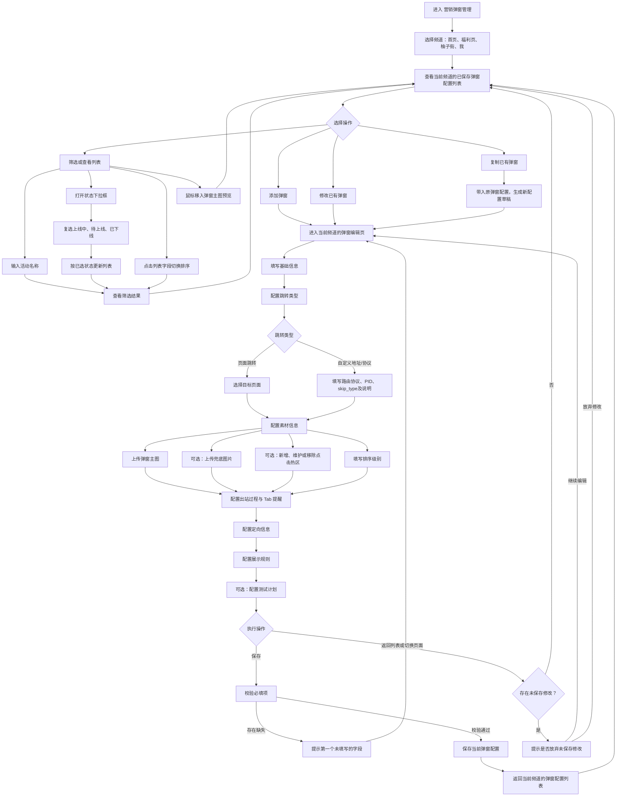

# 营销弹窗管理产品流程图

> 适用入口：`推广管理 > 营销弹窗管理`。流程仅描述后台人员的操作、判断和结果，不包含研发实现逻辑。

## 1. 产品流程图

## 2. 关键流程规则

1. **频道隔离**：首页、福利页、柚子街、我分别维护各自的营销弹窗。切换频道后，仅查看和维护该频道下的配置。
2. **列表查看**：列表仅展示已保存的配置。活动名称支持模糊搜索；状态使用下拉复选，可组合筛选上线中、待上线和已下线；列表字段支持排序，主图支持鼠标移入预览。
3. **统一编辑入口**：添加、修改、复制均进入同一全屏工作区。复制会带入原配置，但保存后形成新的独立弹窗配置。
4. **跳转类型联动**：选择“页面跳转”后维护目标页面；选择“自定义地址/协议”后维护相应的协议与参数信息。
5. **素材与热区**：弹窗主图为必填；兜底图片、点击热区、出站过程配置和 Tab 提醒按实际需要维护。未配置热区时，主图整体作为默认点击区域。
6. **展示与测试**：展示规则用于维护推送频次、重复展示、上下线时间和状态；测试计划用于在有效期内向指定测试用户展示配置，不改变正式展示规则。
7. **保存和离开**：保存时校验必填项，存在缺失则提示首个未填写字段并停留在编辑页。返回列表或离开编辑页时，如有未保存修改，需先确认继续编辑或放弃修改。
