# 营销弹窗管理产品结构图

> 适用入口：`推广管理 > 营销弹窗管理`。本文仅描述当前营销弹窗管理模块的页面结构、配置对象和可操作能力，用于需求澄清；不包含升级弹窗、引导升级弹窗、隐私政策更新弹窗等独立模块。

## 1. 产品结构图

```mermaid
flowchart TB
  A[推广管理] --> B[营销弹窗管理]
  B --> C[频道切换区]
  B --> D[当前频道工作区]

  C --> C1[首页 Home]
  C --> C2[福利页 第2Tab]
  C --> C3[柚子街 第3Tab]
  C --> C4[我 Mine]

  D --> E[弹窗配置列表]
  D --> F[全屏弹窗编辑页]

  E --> E1[列表头部]
  E1 --> E11[弹窗列表标题与说明]
  E1 --> E12[添加弹窗]

  E --> E2[筛选区]
  E2 --> E21[App：美柚省钱App，只读]
  E2 --> E22[所属位置：当前频道，只读]
  E2 --> E23[活动名称：模糊搜索]
  E2 --> E24[状态：下拉选择]
  E24 --> E241[全部]
  E24 --> E242[上线中]
  E24 --> E243[待上线]
  E24 --> E244[已下线]
  E2 --> E25[搜索]

  E --> E3[弹窗配置列表]
  E3 --> E31[仅展示当前频道下已保存配置]
  E3 --> E32[列表字段]
  E32 --> E321[弹窗ID]
  E32 --> E322[排序级别]
  E32 --> E323[活动名称]
  E32 --> E324[弹窗主图]
  E32 --> E325[所属位置]
  E32 --> E326[指定人群]
  E32 --> E327[推送频次]
  E32 --> E328[重复展示]
  E32 --> E329[上下线时间]
  E32 --> E330[状态]
  E32 --> E331[创建人、创建时间]
  E32 --> E332[最新编辑人、最后更新时间]
  E32 --> E333[操作]
  E3 --> E33[列表能力]
  E33 --> E331a[按可排序字段升序或降序]
  E33 --> E332a[鼠标移入主图放大预览]
  E33 --> E333a[修改]
  E33 --> E334a[复制]
  E331a --> E34[刷新当前筛选结果]
  E333a --> F
  E334a --> F
  E12 --> F

  F --> F1[编辑页头部]
  F1 --> F11[返回配置列表]
  F1 --> F12[当前操作：添加、修改或复制]
  F1 --> F13[当前频道名称]
  F --> F2[基础信息]
  F2 --> F21[App：只读]
  F2 --> F22[所属位置：当前频道，只读]
  F2 --> F23[活动名称：必填]

  F --> F3[跳转配置]
  F3 --> F31[跳转类型：必填]
  F31 --> F311[页面跳转]
  F31 --> F312[自定义地址或协议]
  F311 --> F313[目标页面：必填]
  F312 --> F314[路由协议]
  F312 --> F315[PID选择]
  F312 --> F316[skip_type]
  F312 --> F317[地址或协议说明：必填]
  F3 --> F32[路由协议填写示例]

  F --> F4[素材信息]
  F4 --> F41[弹窗主图：必填]
  F41 --> F411[上传图片]
  F41 --> F412[删除图片]
  F4 --> F42[兜底图片]
  F4 --> F43[点击热区]
  F43 --> F431[添加热区]
  F43 --> F432[维护名称、坐标、尺寸和跳转协议]
  F43 --> F433[移除热区]
  F4 --> F44[排序级别]

  F --> F5[出站过程配置]
  F5 --> F51[出站弹窗Logo]
  F5 --> F52[出站弹窗文案]
  F --> F6[Tab提醒配置]
  F6 --> F61[Tab栏提醒方式]
  F6 --> F62[首页固定为不展示红点]

  F --> F7[定向信息]
  F7 --> F71[指定人群]
  F7 --> F72[定制人群]
  F7 --> F73[人群取反]
  F --> F8[展示规则]
  F8 --> F81[推送频次：每日次数与总次数，必填]
  F8 --> F82[重复展示：每天与展示时段]
  F8 --> F83[上下线时间：必填]
  F8 --> F84[状态：上线中或已下线，必填]
  F --> F9[测试计划]
  F9 --> F91[测试UID]
  F9 --> F92[测试有效时间]
  F9 --> F93[测试用户在有效期内可见，不影响正式配置]

  F --> F10[编辑操作]
  F10 --> F101[保存]
  F10 --> F102[必填项校验]
  F102 --> F103[提示第一个未填写字段]
  F101 --> F104[保存当前弹窗配置]
  F104 --> F105[返回当前频道的配置列表]
  F105 --> E3
  F11 --> F106[未保存修改确认]
  F106 --> E
```

## 2. 结构说明与边界

1. **频道是数据边界**：首页、福利页、柚子街、我分别维护各自的营销弹窗配置。切换频道后，列表的“所属位置”和可查看、添加、修改、复制的数据同步切换至该频道。
2. **列表只展示已保存配置**：新增或修改中的草稿不进入配置列表；保存成功后，才按当前筛选条件进入列表结果。
3. **列表筛选与排序**：活动名称支持模糊搜索；状态使用下拉单选（全部、上线中、待上线、已下线）；支持对列表中的可排序字段切换升序或降序。弹窗主图支持鼠标移入放大预览。
4. **编辑页为当前频道内的全屏工作区**：添加、修改、复制均使用同一编辑页，并保留左侧导航和频道切换区域；通过页头左侧“返回”回到列表，不使用右侧关闭按钮。
5. **复制的作用范围**：复制已有配置后进入编辑态，作为新的营销弹窗配置维护；保存后生成当前频道下的一条独立配置。
6. **跳转配置联动**：选择“页面跳转”时配置目标页面；选择“自定义地址/协议”时配置路由协议、PID、`skip_type`和地址/协议说明。页面仅展示与当前跳转类型匹配的配置内容。
7. **热区配置边界**：点击热区可新增多个；每个热区独立维护名称、X/Y 坐标、宽高和跳转协议，并可单独移除。未配置热区时，弹窗主图整体为默认点击区域。
8. **展示优先级**：排序级别数值越大，弹窗在当前频道中越靠前展示；该规则由列表“排序级别”字段和编辑页配置共同维护。
9. **保存与返回**：保存前对必填项校验，缺失时提示第一个未填写字段并停留在编辑页；从编辑页返回且存在未保存修改时，先由用户确认是否放弃修改。
